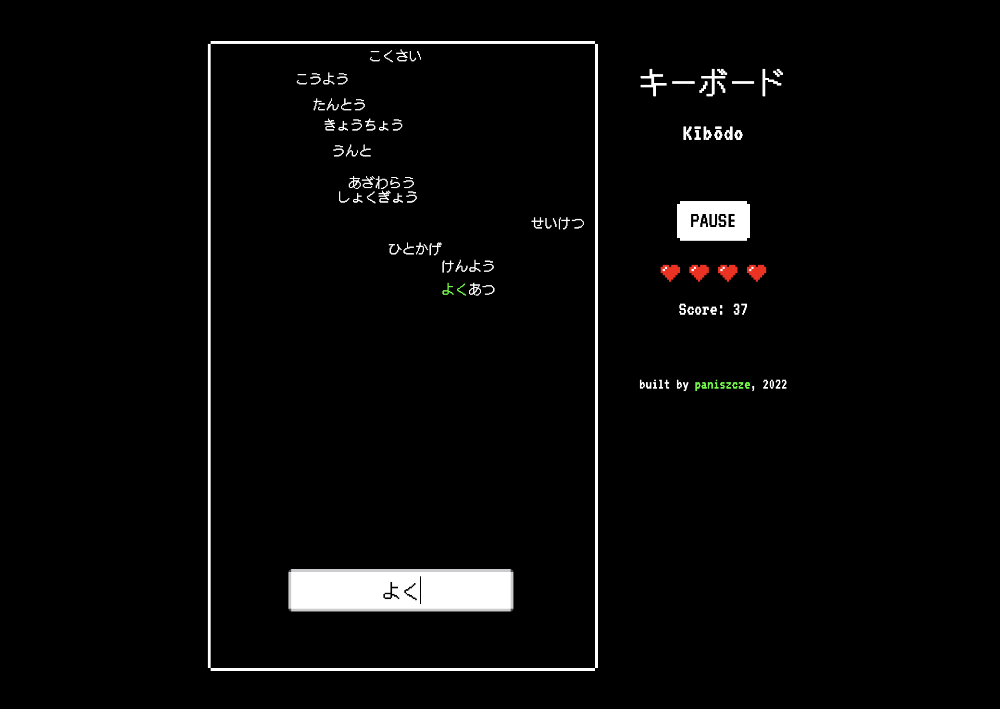

# キーボード

Gamified typing practice of Japanese kana.

## About

キーボード (Kībōdo) is a single page application built with React. It was developped for Japanese language learners to make the skill of typing Japanese caracters a bit more fun to master.

The task at hand is to type Japanese words that appear on the screen before they move downward and reach the bottom line of the frame. Each correctly typed word earns you some points, and each missed one – costs you a life! But don't worry, you have 4 of them. Just make sure to endure as long as possible and gain a ton of points!

The word list includes entries written in hiragana and katakana only. There are no kanji characters in order to make the practice more about typing and memorizing keyboard layout rather than recognizing kanji.

Good luck!

---

***Note***: *Application expects input already in Japanese, so make sure to switch to Japanese keyboard layout before starting to type. There is no conversion of latin alphabet letters nor any key mappings.*
